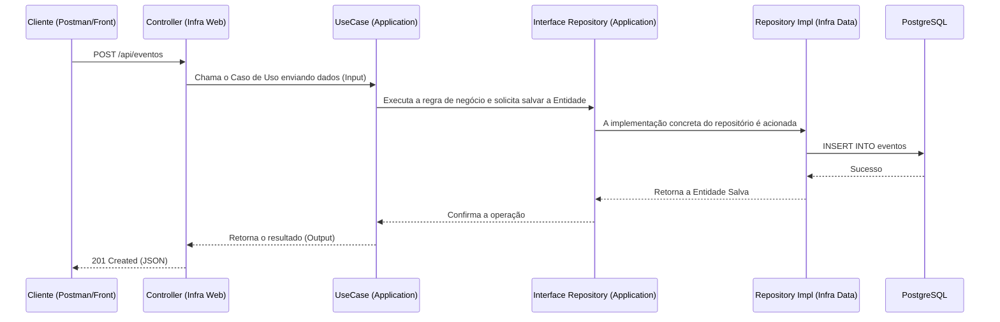

# CineBark 🎬🐾

O **CineBark** é um projeto de gerenciamento de eventos desenvolvido em **Java 17** com **Spring Boot**. Este projeto foi construído seguindo rigorosamente os princípios da **Clean Architecture (Arquitetura Limpa)**, garantindo um código altamente testável, desacoplado e de fácil manutenção.

---

## 🛠️ Tecnologias Utilizadas

- **Linguagem:** Java 17
- **Framework:** Spring Boot
- **Banco de Dados:** PostgreSQL
- **Migrações de Banco:** Flyway
- **Gerenciador de Dependências:** Maven
- **Utilitários:** Lombok
- **Infraestrutura:** Docker e Docker Compose

---

## 🏛️ Arquitetura (Clean Architecture)

A adoção da **Clean Architecture** permite que a regra de negócio central (Domínio) fique isolada de detalhes externos, como banco de dados, frameworks web e interfaces de usuário.

A estrutura de dependências aponta sempre de fora para dentro, ou seja, as camadas mais externas (como banco de dados e UI) dependem das camadas mais internas (regras de negócio).

### Fluxograma de Dependência das Camadas

```mermaid
graph TD
    subgraph Camadas Externas (Frameworks & Drivers)
        UI[Controllers / Web]
        DB[Database / Infra Repositories]
        Ext[APIs Externas]
    end

    subgraph Adaptadores de Interface
        Gateways[Gateways / Presenters / DTOs]
    end

    subgraph Casos de Uso (Application)
        UC[Use Cases / Interactors]
    end

    subgraph Entidades (Domain)
        Ent[Entidades de Domínio / Regras Corporativas]
    end

    UI --> Gateways
    DB --> Gateways
    Ext --> Gateways
    Gateways --> UC
    UC --> Ent

    classDef external fill:#f9f,stroke:#333,stroke-width:2px,color:#000;
    classDef adapters fill:#bbf,stroke:#333,stroke-width:2px,color:#000;
    classDef usecases fill:#bfb,stroke:#333,stroke-width:2px,color:#000;
    classDef entities fill:#fbb,stroke:#333,stroke-width:2px,color:#000;

    class UI,DB,Ext external;
    class Gateways adapters;
    class UC usecases;
    class Ent entities;
```

### Fluxo de Dados (Exemplo de uma Requisição Web)

Quando uma requisição chega à API, o fluxo de comunicação entre as camadas ocorre da seguinte forma, respeitando a inversão de controle da Clean Architecture:



---

## 🚀 Como Executar o Projeto

### Pré-requisitos
- [Java 17+](https://adoptium.net/)
- [Docker e Docker Compose](https://www.docker.com/)
- Uma IDE de sua preferência (IntelliJ IDEA, Eclipse, VS Code, etc.)

### Passos para rodar localmente

1. **Clone o repositório e acesse a pasta:**
   ```bash
   git clone <URL_DO_SEU_REPOSITORIO>
   cd CineBark
   ```

2. **Suba o banco de dados com o Docker Compose:**
   O projeto possui um arquivo `docker-compose.yml` pré-configurado com as credenciais do PostgreSQL.
   ```bash
   docker-compose up -d
   ```

3. **Execute o projeto utilizando o Maven Wrapper:**
   O Flyway entrará em ação automaticamente durante a inicialização do Spring Boot para criar e gerenciar as tabelas no banco de dados.

   No Windows:
   ```cmd
   mvnw.cmd spring-boot:run
   ```
   No Linux/Mac:
   ```bash
   ./mvnw spring-boot:run
   ```

4. **Acesse a API:**
   Por padrão, o servidor da aplicação estará escutando na porta `8080`.

---

## 🧪 Testes

O projeto está configurado com as dependências do `spring-boot-starter-test`, o que possibilita a construção de testes unitários e de integração de maneira simplificada.

Para executar os testes automatizados da aplicação, rode:

No Windows:
```cmd
mvnw.cmd test
```
No Linux/Mac:
```bash
./mvnw test
```

---

## 🤝 Contribuição

1. Faça o **fork** deste repositório.
2. Crie uma branch para a sua feature: `git checkout -b feature/minha-feature`
3. Commit as suas alterações: `git commit -m "feat: adiciona nova funcionalidade X"`
4. Faça o push para a branch: `git push origin feature/minha-feature`
5. Abra um **Pull Request**.